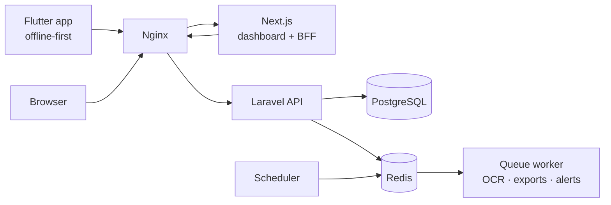

<p align="center">
  
</p>

<h1 align="center">Masroof · مصروف</h1>

<p align="center">
  Bilingual personal finance for Arabic and English speakers: accounts, transactions, budgets,
  goals, recurring payments, insights, reports and receipt scanning, on Android, iOS and the web.
</p>

---

## Features

| Area | What you get |
|------|--------------|
| **Accounts** | Cash, bank, card, wallet and savings accounts in ILS, USD, JOD, EUR and more; transfers, including across currencies; archiving |
| **Transactions** | Income, expenses and transfers with categories and subcategories, tags, merchant, payment method, notes; search, filters, duplicate, swipe actions |
| **Budgets** | Weekly, monthly or custom budgets per category with alert thresholds, projected spend, and safe-to-spend per day that ignores fixed costs |
| **Goals** | Savings goals with contributions, monthly amount needed and expected completion date |
| **Recurring** | Salaries, rent and subscriptions generated automatically or as reminders, with catch-up and duplicate protection |
| **Dashboard and analytics** | Totals per currency, month over month, category breakdown, trends over up to 24 months |
| **Insights** | Deterministic rules (no AI): budget risk, spending changes, subscription increases, large or unusual spending, possible duplicates, savings rate |
| **Notifications** | Budget thresholds, bill reminders, goal pace, weekly/monthly summaries, in-app and by email, with per-type preferences |
| **Reports** | CSV, Excel and PDF (with correct Arabic shaping and RTL) generated in the background |
| **Receipt scanning** | Photo → local Tesseract OCR (Arabic + English) → merchant, total, date, currency and suggested category → review → save |
| **Offline** | The mobile app works fully offline for accounts, categories and transactions and syncs with a documented conflict strategy |
| **Admin** | Aggregate platform stats, user suspension, service health and failed jobs, with no access to anyone's financial data, and an audit log |
| **Arabic first** | Arabic default with full RTL across web, mobile, emails, notifications and PDFs; English available everywhere |

## Repository

| Path | Stack |
|------|-------|
| [`backend/`](backend) | Laravel 13 · PHP 8.5 · PostgreSQL 17 · Redis · Sanctum · queues · scheduler · Tesseract |
| [`web/`](web) | Next.js 16 · TypeScript · Tailwind CSS 4 · shadcn/ui · TanStack Query · Recharts |
| [`mobile/`](mobile) | Flutter · Riverpod · GoRouter · Dio · Drift (SQLite) · flutter_secure_storage · fl_chart |
| [`branding/`](branding) | Icon generator and brand assets |
| [`docker/`](docker), [`compose.yaml`](compose.yaml) | Production images, nginx, Compose stack |
| [`docs/`](docs) | Architecture, offline sync, OCR, development, deployment, OpenAPI |
| [`.github/workflows/`](.github/workflows) | CI for backend, web, mobile and Docker images |



## Quick start (Docker)

```bash
cp .env.example .env
docker compose run --rm --no-deps migrate php artisan key:generate --show   # paste into APP_KEY
# set DB_PASSWORD and REDIS_PASSWORD in .env
docker compose up -d --build
open http://localhost:8080
```

See [docs/deployment.md](docs/deployment.md) for configuration, TLS, backups and admin access.

## Local development

```bash
docker compose -f compose.dev.yaml up -d                 # PostgreSQL, Redis, Mailpit

# API: http://127.0.0.1:8000  (docs at /docs/api)
cd backend && cp .env.example .env
../scripts/php composer install && ../scripts/php php artisan key:generate
../scripts/php php artisan migrate --seed
../scripts/php php artisan serve --host=127.0.0.1 --port=8000

# Web: http://localhost:3000
cd web && cp .env.example .env.local && npm install && npm run dev

# Mobile
cd mobile && flutter pub get && flutter run
```

Demo login: **demo@masroof.app / password1**. Admin: **admin@masroof.app / password1**
(local seed only). Full instructions: [docs/development.md](docs/development.md).

## Quality

| | Format / lint | Types / analysis | Tests |
|--|--|--|--|
| Backend | Pint | Larastan level 6 | PHPUnit feature and unit tests (auth, money, balances, budgets, goals, analytics, recurring, notifications, exports, receipts, admin) |
| Web | Prettier, ESLint | TypeScript strict | Vitest + Testing Library |
| Mobile | `dart format`, `flutter analyze` | Dart | Unit, repository, sync engine and widget flow tests |

All run in CI on every push and pull request, which also builds release APK/AAB artifacts and the
Docker images.

## Documentation

* [Architecture](docs/architecture.md): components, data model, auth, jobs, privacy
* [Offline sync and conflicts](docs/offline-sync.md)
* [Receipt scanning and OCR](docs/receipts-ocr.md)
* [API reference (OpenAPI)](docs/openapi.json)
* [Branding: icon and splash](docs/branding.md)

## Security and privacy

* Money is stored as integers in minor units; balances change only inside locked database
  transactions and are verified nightly.
* API tokens expire and rotate; the web app keeps them in httpOnly cookies behind a same-origin
  backend-for-frontend; mobile keeps them in the Keychain / Keystore.
* Every record is scoped to its owner (other users' IDs return 404). Rate limits protect auth,
  uploads and exports.
* Deleting an account permanently removes all data, receipt photos and exports.
* Administrators see aggregates and account state only, and every admin action is audited.
