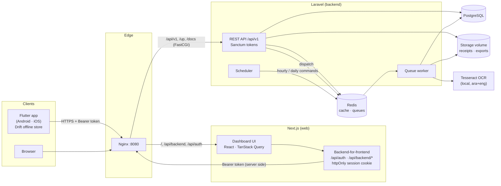
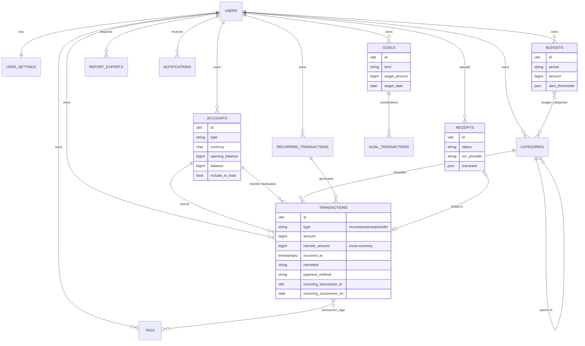
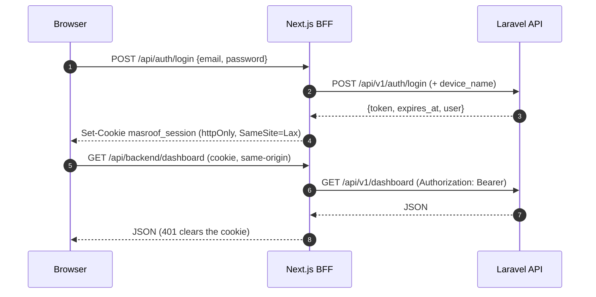
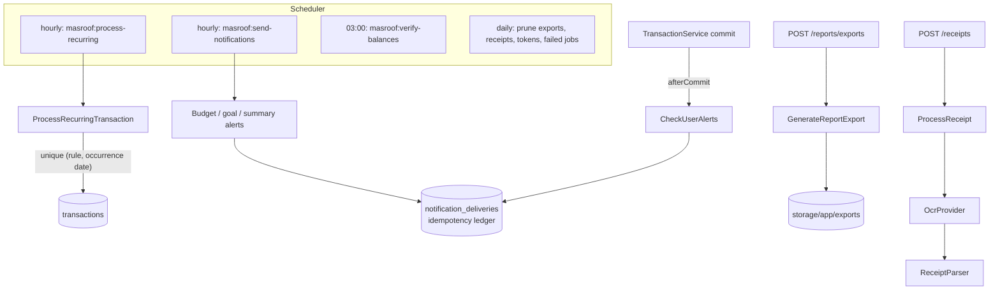

# Architecture

Masroof is a bilingual (Arabic-first, RTL / English) personal finance product made of three
applications around one API.



## Components

| Component | Responsibility |
|-----------|----------------|
| **backend/** (Laravel 13, PHP 8.5) | Single source of truth. Auth, validation, balance integrity, budgets, goals, analytics, insights, recurring payments, notifications, exports, receipts, admin. |
| **Queue worker** | Recurring transaction generation, alert checks, report exports, receipt OCR, mail. |
| **Scheduler** | Hourly recurring processing and notification digests, nightly balance verification, pruning. |
| **web/** (Next.js 16) | Responsive dashboard. A backend-for-frontend keeps the API token in an httpOnly cookie so it never reaches browser JavaScript. |
| **mobile/** (Flutter) | Offline-first app. Drift is the local source of truth for accounts, categories and transactions; see [offline-sync.md](offline-sync.md). |

## Backend structure

```
app/
  Http/Controllers/Api/V1/   thin controllers (one per resource) + Admin/
  Http/Requests/Api/V1/      validation (money, ownership, transfers)
  Http/Resources/V1/         JSON shapes (decimal strings + *_minor integers)
  Services/                  domain logic: TransactionService, BudgetCalculator, GoalService,
                             AnalyticsService, Insights/*, RecurringService, AlertChecker, Ocr/*
  Jobs/                      ProcessRecurringTransaction, CheckUserAlerts, GenerateReportExport, ProcessReceipt
  Notifications/             database + mail notifications, localized at display time
  Reports/                   format-neutral report → CSV / XLSX (OpenSpout) / PDF (mPDF, Arabic shaping)
  Policies/                  ownership checks (foreign records answer 404)
  Support/                   Money, Period helpers
```

### Money

* Amounts are stored as **integer minor units** (`bigint`) with the currency's exponent
  (JOD uses 3 decimals, ILS/USD/EUR use 2). Floats are never used.
* The API accepts decimal strings (`"24.40"`) and returns both a decimal string and a `*_minor`
  integer. Arabic-Indic digits are normalized on input.
* Primary currencies are ILS, USD, JOD and EUR; others are supported without conversion.
  Totals are always grouped per currency.

### Balance integrity

`TransactionService` is the only write path for transactions. Every create, update, delete and
duplicate computes balance *effects* per account and applies them inside a database transaction
with row locks taken in a stable order (avoids deadlocks between transfers). A nightly
`masroof:verify-balances` recomputes balances from history and reports drift (`--fix` repairs).
PostgreSQL `CHECK` constraints guard amounts and transfer shape.

### Identifiers and idempotency

All user-owned records use **ULIDs**. Clients may send their own `id` on create; replaying the same
create returns the existing record (200) and an ID owned by another user returns 409. This is what
makes mobile offline creation and retries safe.

## Data model



Soft deletes keep user records recoverable and let offline clients learn about deletions
through sync (accounts, categories, transactions). `admin_audit_logs`, `notification_deliveries` (idempotent alerts) and
`failed_jobs` support operations.

## Authentication



* Sanctum personal access tokens with expiry (`MASROOF_TOKEN_TTL_MINUTES`), refresh rotation,
  per-device session list and revocation.
* Mobile stores its token in the Keychain / Android Keystore.
* Rate limits on auth, password reset, API, exports and receipt uploads. Suspended users are
  rejected by the `active` middleware and lose all tokens at suspension.
* Email verification and password reset links point to the web app.

## Localization

* `Accept-Language` (then the user's saved locale) selects Arabic or English for validation
  messages, notifications, category names, insights and reports.
* Notifications store raw parameters (e.g. `{minor, currency}`) and are formatted when displayed,
  so a message reads correctly after the user switches language.
* Web and mobile mirror layouts for RTL. Numbers and amounts are wrapped in bidi isolates so
  `₪ -24.40` never reorders inside Arabic text. PDFs use IBM Plex Sans Arabic with OpenType shaping.

## Background work



* Recurring rules are anchored schedules; catch-up generates missed occurrences, a unique index on
  `(recurring_transaction_id, recurring_occurrence_on)` prevents duplicates, and "remind" rules
  notify instead of posting.
* Alerts are sent once per threshold per period thanks to the delivery ledger.
* Dates are evaluated in the user's timezone and financial month (`month_start_day`, `week_start`).

## Insights

Insights are **deterministic rules**, never AI: budget risk (projected overspend), category
spending change versus the previous period, subscription price increases, large purchases,
unusual spending days, possible duplicate transactions and savings rate. Each rule returns a type, severity and localized parameters; see
`app/Services/Insights`.

## Admin and privacy

The admin API (`/api/v1/admin/*`, role `admin`, granted only with `php artisan masroof:admin`)
exposes **aggregate counts** (users, activity, OCR usage), account state (verification,
suspension, last activity) and service health. It never returns balances, amounts, merchants,
notes or receipts. Failed jobs show only the job class, queue and the exception's first line
because payloads can contain user data. Every admin action is written to `admin_audit_logs`.
Non-admins receive 404 for the whole admin surface.

## Web architecture

* App Router with route groups: `(auth)`, `(setup)` onboarding, `(public)` verification, `(app)`.
* `src/proxy.ts` redirects unauthenticated page requests; the BFF enforces same-origin for
  mutations and forwards JSON, multipart uploads and binary downloads.
* TanStack Query hooks in `src/hooks` own server state; shadcn/ui components with RTL support.

## Mobile architecture

* Features are split into `data` (repositories), `application` (Riverpod providers) and
  `presentation` (screens).
* Accounts, categories and transactions live in Drift and sync through an outbox. Server-computed
  views (dashboard, budgets, goals, analytics, recurring, notifications) are fetched online and
  cached with a "last updated" notice when offline.

## API

REST, versioned under `/api/v1`, documented in [openapi.json](openapi.json) and served
interactively at `/docs/api` outside production. Errors use standard status codes: 422 with
field errors, 404 for missing or foreign records, 409 for conflicts, 429 for rate limits.
