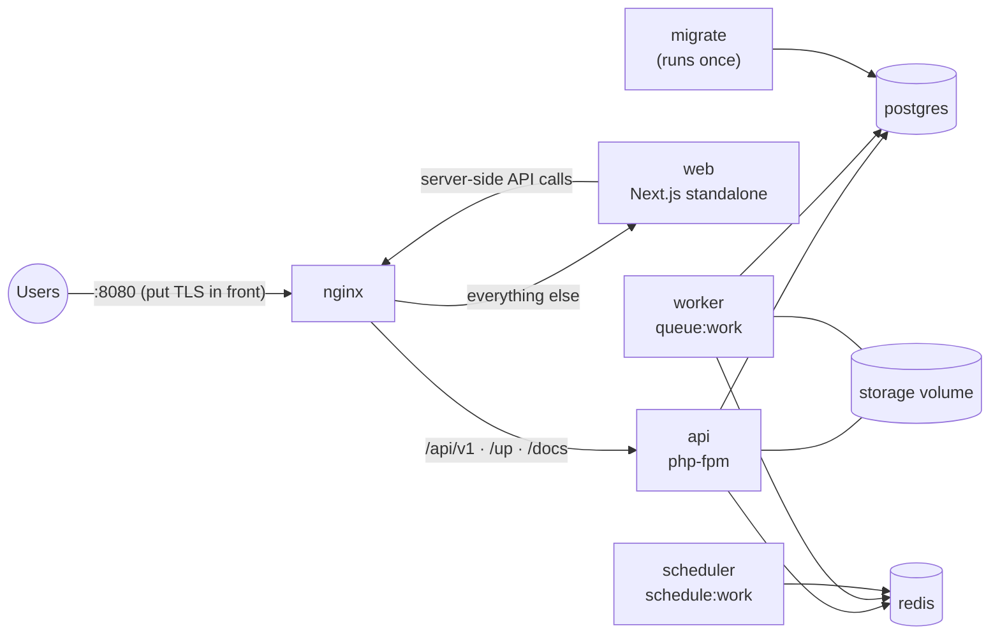

# Deployment

The repository ships a production-like Docker Compose stack (`compose.yaml`).



| Service | Image | Role |
|---------|-------|------|
| `postgres` | postgres:17-alpine | Database (volume `postgres`) |
| `redis` | redis:7-alpine | Cache and queues, password protected, AOF persistence |
| `migrate` | `masroof-api` | Runs `php artisan migrate --force`, then exits |
| `api` | `masroof-api` (docker/php/Dockerfile, target `prod`) | PHP-FPM serving the API |
| `worker` | `masroof-api` | Queue worker: OCR, exports, alerts, recurring jobs, mail |
| `scheduler` | `masroof-api` | Laravel scheduler |
| `web` | `masroof-web` (docker/web/Dockerfile) | Next.js dashboard and backend-for-frontend |
| `nginx` | nginx:1.27-alpine | Single entry point on `MASROOF_HTTP_PORT` (default 8080) |

## First start

```bash
cp .env.example .env
# Generate an application key and paste it into APP_KEY
docker compose run --rm --no-deps migrate php artisan key:generate --show
# Set strong DB_PASSWORD and REDIS_PASSWORD, and APP_URL to the public URL
docker compose up -d --build
docker compose ps
curl -fsS http://localhost:8080/up
```

Create the first administrator after registering the account in the app:

```bash
docker compose exec api php artisan masroof:admin you@example.com
```

For a demo instance, set `APP_ENV=staging` and run `docker compose exec api php artisan db:seed`
(seeding is refused when `APP_ENV=production`).

## Configuration

| Variable | Purpose |
|----------|---------|
| `APP_KEY` | Laravel encryption key (required) |
| `APP_URL` | Public URL; used for links in emails and CORS |
| `APP_ENV` | `production` (default) or `staging` |
| `DB_*`, `REDIS_PASSWORD` | Database and Redis credentials |
| `MAIL_*` | SMTP for verification and password-reset emails (`MAIL_MAILER=log` writes to logs) |
| `MASROOF_OCR_DRIVER` | `tesseract` (default, bundled) or `mock` |
| `MASROOF_COOKIE_SECURE` | `true` when served over HTTPS (session cookie `Secure` flag) |
| `MASROOF_HTTP_PORT` | Host port for nginx |
| `MASROOF_VERSION` | Image tag |

Secrets belong in `.env` on the server (or your orchestrator's secret store), never in git.

## TLS and reverse proxy

nginx listens on plain HTTP inside the stack. Terminate TLS in front of it (Caddy, Traefik, a
cloud load balancer) and forward `X-Forwarded-Proto`. Laravel trusts proxy headers. Then set
`APP_URL=https://…` and `MASROOF_COOKIE_SECURE=true`.

## Mobile apps

Build with the production API baked in:

```bash
flutter build appbundle --release --dart-define=MASROOF_API_URL=https://masroof.example.com
```

(`MASROOF_API_URL` is the origin; the app appends `/api/v1`.)

## Operations

* **Health:** `GET /up` (Laravel), nginx healthcheck, and the admin dashboard's *System* tab
  (database, cache, queue size, failed jobs, OCR driver).
* **Logs:** containers log to stdout/stderr: `docker compose logs -f api worker scheduler`.
* **Failed jobs:** retry or delete from the admin dashboard, or
  `docker compose exec api php artisan queue:retry all`.
* **Balance integrity:** `masroof:verify-balances` runs nightly; investigate any report, and use
  `--fix` to recompute from history.
* **Backups:** back up PostgreSQL and the `storage` volume (receipts, exports):

  ```bash
  docker compose exec -T postgres pg_dump -U masroof -Fc masroof > masroof-$(date +%F).dump
  docker run --rm -v masroof_storage:/data -v "$PWD":/backup alpine tar czf /backup/storage-$(date +%F).tgz -C /data .
  ```

* **Upgrades:** `git pull && docker compose up -d --build`. The `migrate` service applies new
  migrations before the API and workers restart.
* **Scaling:** run more `worker` replicas for OCR/export load. The scheduler must stay single
  (commands also use `onOneServer`). API containers are stateless apart from the shared storage
  volume; use shared object storage before running API replicas on multiple hosts.
