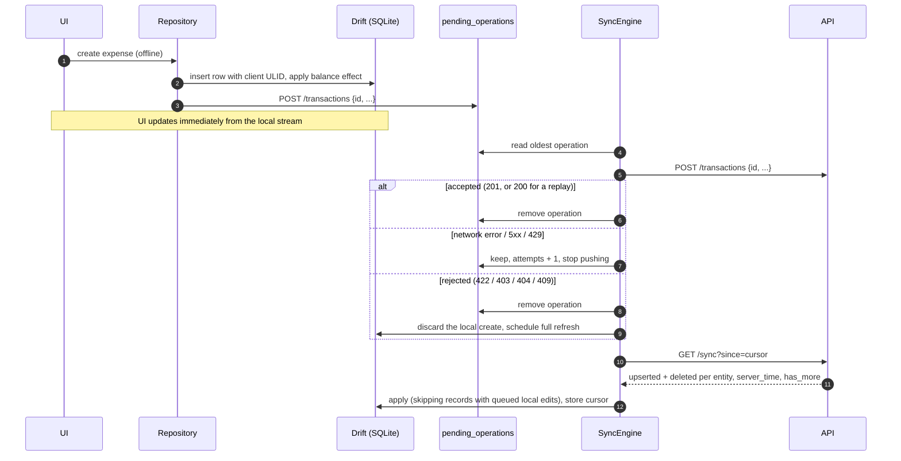

# Offline sync (mobile)

The Flutter app works without a connection. Accounts, categories and transactions are stored in a
local SQLite database (Drift) that the UI reads from exclusively. The server remains the source of
truth, and sync makes the device converge to it.

## Local writes

1. The repository writes the record, including an optimistic balance update, inside one Drift
   transaction.
2. The same transaction appends an operation to the **outbox** (`pending_operations`): method,
   entity, id and JSON payload, ordered by a sequence number.
3. **Folding:** editing a record whose create has not been pushed merges the new fields into that
   pending `POST` instead of queueing a `PATCH`. Deleting a never-pushed record removes its queued
   operations and sends nothing.

IDs are ULIDs generated on the device, so records have their final identity immediately and
related records (for example a transaction's account) can be created offline in the same session.

## Push

* Operations are replayed strictly in order, so a transaction never reaches the server before the
  account it references.
* Creates are **idempotent**: the API returns the existing record when the same client ID is
  replayed (the response to an earlier attempt may have been lost). A scanned receipt's
  `receipt_id` travels with the create and stays valid on replay.
* **Transient failures** (no network, timeouts, 5xx, 429) stop the run and keep the queue intact.
  The next trigger (app resume, connectivity regained, pull-to-refresh, or a new local change)
  retries.
* **401** stops sync and signs the user out.
* **Permanent rejections** (422 validation, 403, 404, 409) drop the operation, discard a rejected
  local create and force a **full refresh**, so the device returns to the server's state. The count
  of rejected changes is shown to the user.
* `DELETE` answered with 404 is treated as success (already deleted elsewhere).

## Pull

`GET /api/v1/sync?since=<cursor>` returns, per entity, records `upserted` and IDs `deleted` since
the cursor (soft deletes make deletions visible), plus `server_time` and `has_more`.

* The cursor is the server's time captured **before** querying, so writes that race with the pull
  are returned next time rather than skipped. Paging uses `has_more` with at most 1,000 rows per
  entity per page.
* A full refresh (no cursor) replaces all synced rows but keeps records that still have queued
  operations.
* Server rows overwrite local rows, including balances, which are always recomputed by the server.

## Conflict strategy

| Situation | Resolution |
|-----------|------------|
| Same record edited on two devices | **Last write wins per record.** A queued `PATCH` carries the record as the user last saved it, so the edit that reaches the server last wins and every device converges on its next pull. |
| Pull brings a server version of a record that has unpushed local edits | The local version is kept (the pull skips it) until the outbox is pushed, then the next pull returns the merged server state. The user never sees their pending edit "jump back". |
| Record deleted on another device, edited locally | The `PATCH` gets 404, is dropped, and the full refresh removes the record locally. Deletion wins; the user sees a "changes could not be saved" notice. |
| Record edited on another device, deleted locally | The `DELETE` is applied; deletion wins. |
| Local create rejected by validation (e.g. account archived elsewhere) | The local record is discarded and a full refresh restores server state; the rejected count is surfaced. |
| Duplicate submission (retry after a lost response) | Idempotent create by client ULID returns the existing record; no duplicates. Recurring transactions additionally use a unique occurrence index. |
| Balance drift | Balances are never merged. The server computes them transactionally from history, and pulls replace local balances. A nightly job verifies stored balances against history. |
| Category deleted with a replacement on another device | Affected transactions are reassigned server-side and arrive as upserts on the next pull. |

Why this approach: financial data needs predictable, explainable outcomes rather than silent
automatic merges. A personal finance record is usually edited by one person at a time, so
record-level last-write-wins is easy to reason about, server-computed balances keep totals
correct whatever order edits arrive in, and anything the server refuses is rolled back visibly
instead of diverging.

## Server-computed data

Dashboard, budgets, goals, analytics, insights, recurring rules, notifications and exports depend
on server calculations. They are fetched online and cached (`CachedResource`); offline, the app
shows the last snapshot with a "last updated" notice. Receipt scanning requires a connection
because OCR runs on the server; the transaction created from the result is still saved offline.
