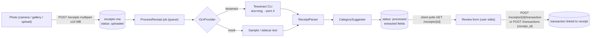

# Receipt scanning



## Providers

OCR sits behind `App\Services\Ocr\OcrProvider`:

```php
interface OcrProvider
{
    public function name(): string;
    public function recognize(string $absolutePath, string $mimeType): string;
}
```

| Driver (`MASROOF_OCR_DRIVER`) | Notes |
|-------------------------------|-------|
| `tesseract` (default) | Free and fully local. The API image installs `tesseract-ocr` with Arabic and English data. Options: `MASROOF_TESSERACT_BINARY`, `MASROOF_TESSERACT_LANGUAGES`. |
| `mock` | No engine required; returns a sample receipt or the contents of `<image>.txt`. Used by the test suite and handy for UI work. |

To add a provider (for example a cloud OCR service), implement the interface and add a case to
the binding in `AppServiceProvider::register()`. No paid service is required.

## Parser

`ReceiptParser` is deterministic and bilingual:

* Normalizes Arabic-Indic digits and Arabic decimal/thousands separators.
* **Total:** the last line matching a total keyword (`total`, `amount due`, `الإجمالي`,
  `المجموع`, `المطلوب`, …), skipping subtotal/tax/discount/change lines, falling back to the
  largest amount.
* **Currency:** symbols and words (`₪`, `NIS`, `شيكل`, `JOD`, `دينار`, `$`, `€`, …), otherwise the
  user's default currency. Amounts are converted to minor units with the currency's exponent.
* **Date:** `Y-m-d`, `d/m/Y` and `d/m/y` (with `/`, `-` or `.`); dates more than a day in the
  future are ignored.
* **Merchant:** the first of the top five lines that is mostly letters and is not a header such as
  "receipt", "فاتورة", a phone number or a date line.
* **Confidence:** share of merchant, total and date found. The UI flags partial results.

## Category suggestion

1. The category the user most often used for the same merchant.
2. Otherwise a keyword map (supermarket → Groceries, pharmacy → Healthcare, مطعم → Restaurants, …).

## Privacy and lifecycle

* Photos are stored on the private `local` disk under `receipts/<user id>/` and served only to
  their owner (`GET /receipts/{id}/image`); other users receive 404.
* Raw OCR text is capped and never exposed through the admin API.
* Scans never saved as a transaction are deleted after 7 days (`masroof:prune-receipts`).
  Deleting an account deletes all of the user's receipt files.
* OCR failures are logged with the receipt ID only; the client receives a generic localized
  message and can enter the transaction manually.
